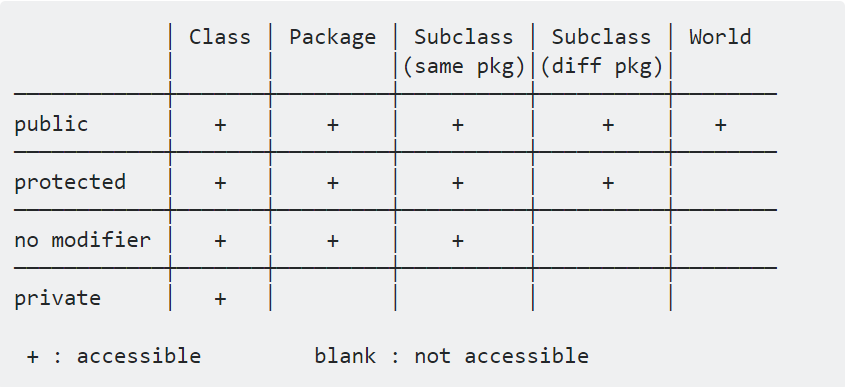

[### Week 1:](../README.md)

During the first week of independent study, I explored through my options, my inital thought was something along the lines of python ML, but I didn't know what I wanted to make of it.
 
This lead me to recount my opitions again and I went with one of the most pratices languages in Computer Science classes - Java.
 
Private vs Protected vs Public vs Packaged
  
<b>[Next &rarr;](Entry_2.md)</b>